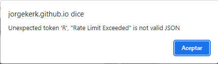

# MI APP 📷 GALERÍA DE IMÁGENES 📸

 

------------

😊 Gracias por ingresar a este repositorio 😊

----------
 

**Introducción**

Este proyecto consiste en el desarrollo de una página web que muestra imágenes aleatorias consumidas desde la **API Rest Unsplash**. También tendtrá la posibilidad de filtrar por una palabra o frase ingresada por usted, o de filtrar por algún Topic ( o palabra clave ) si la imagen se encuentran topicos en la imágen. Por último, si la imágen es de su agrado, podrá descargarla de la página simplemente hacioendo click en el botón de descarga ( ↓ ).

 

> El proyecto está hecho con:
- Vite React Js
- CSS
- Y las siguientes dependencias de React:
    - **Aos** ( Realiza animaciones al cargar las tarjetas/imágenes )
    - **Axios** ( Permite que la página se comunique con la **API Rest Unsplash** a travez de peticiones GET )
    - **DotEnv** ( Permite resguardar claves e información delicada que no debe ser compartida con nadie ).
    - **File Saver** ( Permite descargar echivos, en este caso, imágenes). 
    - **React Infinite Scroll Component** ( Permite hacer Scroll infinito en la Página ).
    - **React Parallax Tilt** ( Permite realizar un efecto de movimiento al posicionarse sobre cada tarjeta/imágen ).

 

**Descricpión**

En esta página podrá realizar los siguiente:

>Inicialmente se cargarán imagenes al azar desde la **API Rest Unsplash** y al ir scrolleando hacia abajo pordrá ver imágenes aleatorias.

>Dentro de la página encontrará la siguiente barra de búsqueda:

en la misma pordrá buscar una imágen específica, como por ejemplo, 'musica'. Al presionar el botón 'Buscar', se mostrarán imágenes relacionadas a la música y el filtro 'Música' se cargará para tener conociemiento que las imágenes mostradas son relacionadas a este filtro. En este momento, la barra de búsqueda se mostrará de la siguiente manera:

Podrá buscar otra palabra o frase, o podrá eliminar el filtro presionando el botón 'X' que en nuestro ejemplo se encuentra a la derecha del filtro 'MUSICA' cargado.

> Por último, si ha realizado un scroll hacia abajo y desea volver al inicio de la página rápidamente, puede realizar un click en el título 'GALERÍA DE IMAGENES'.

  

# **Link a la página web**
> [▶ Inicio:](https://jorgekerk.github.io/TP2-APPI-PHOTOS-UNSPLASH-UTN/) 

**Advertencia:** La petición a la API Rest Unsplash es una demo, por lo tanto, las imágenes traídas son limitadas y puede ser que en algún momento salga la siguiente advertencia:

En este caso, deberá esperar una hora antes de volver a utilizar la página.

 

Espero que esta página le sea de su agrado y de su utilidad, lo saludo cordialmente ***JORGE KERK***.